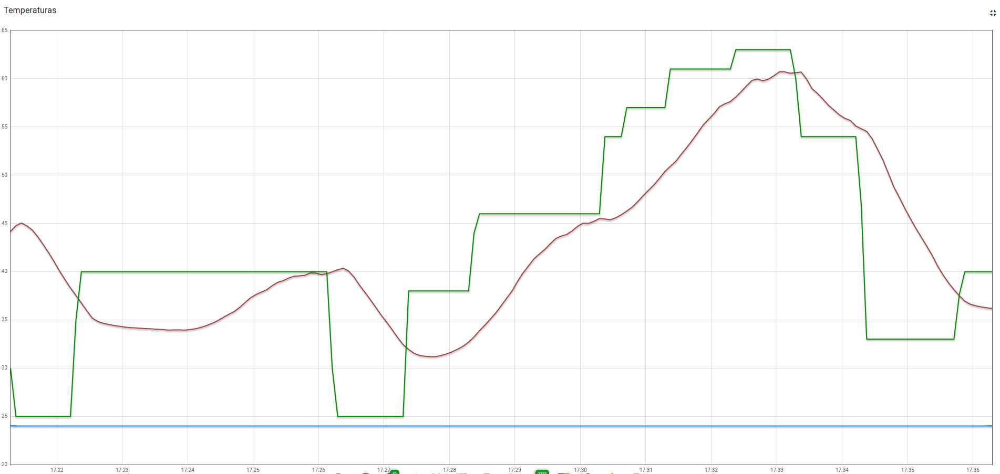
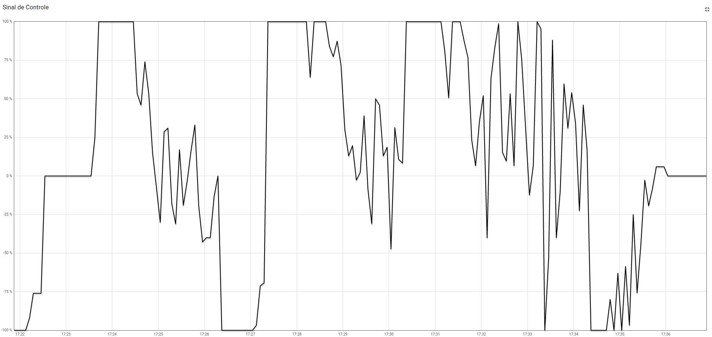
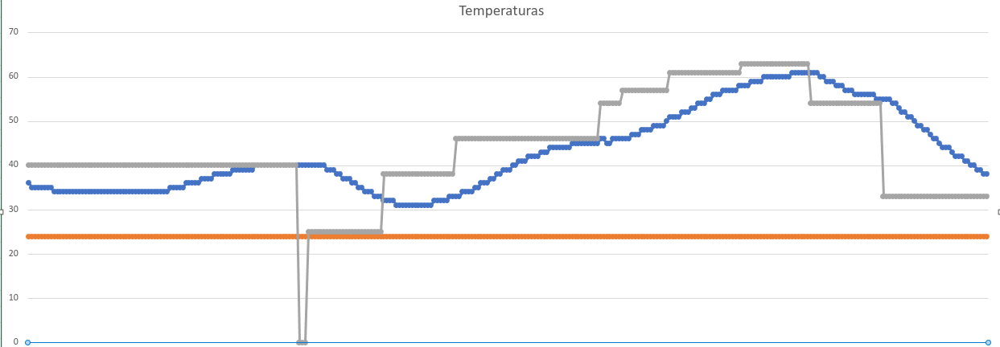

# Trabalho 2 da disciplina de Fundamentos de Sistemas Embarcados (2022/2)

- **Aluno**: Carlos Eduardo de Sousa Fiuza
- **Matrícula**: 19/0056843

## Objetivo

Este trabalho tem por objetivo a implementação de um sistema (que simula) o controle de um forno para soldagem de placas de circuito impresso (PCBs).

## Descrição

O trabalho foi desenvolvido em linguagem c. Para sua execução basta:
```bash
git clone https://github.com/CarlosFiuza/FSE-Trabalho2
```

```bash
cd FSE-Trabalho2/trab2-c
```

```bash
make
```

```bash
./bin/bin
```

## Interface

Não foi implementada a interface de usuário no terminal. Apenas é possível passar como argumentos as constantes de PID (Kp, Ki e Kd).

## Gráficos

- Gráfico de temperatura do experimento:
<div align="center">
    </img>
</div>

- Gráfico de sinal de controle do experimento:
<div align="center">
    </img>
</div>

- Gráfico de temperatura do experimento de acordo com arquivo de log:
<div align="center">
    </img>
</div>


**OBS**: na pasta assets é possível encontrar log gerado pelo programa durante o experimento.


## Apresentação
[O vídeo pode ser encontrado aqui.](/assets/presentation.mkv)
